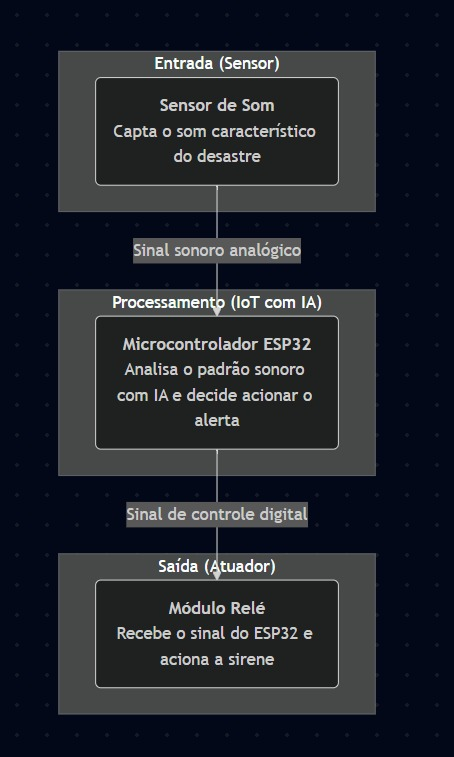

# PROTECH: Prevenindo Eventos Extremos da Natureza

**Disciplina:** Computer Organization and Architecture
**Alunos:**
* **Nome:** [Seu Nome Completo Aqui]
* **RM:** [Seu RM Aqui]
* **Turma:** [Sua Turma Aqui]

---

### a) Especificação da Placa de Controle (Microcontrolador)

* **Modelo Específico:** `Módulo ESP32-WROOM-32`
* **Justificativa Detalhada:** A escolha deste microcontrolador é fundamentada em suas características avançadas que se alinham perfeitamente com a proposta de um sistema de IoT com IA.
    * **Processamento Dual-Core:** Equipado com um processador Tensilica Xtensa LX6 de dois núcleos, permite que um núcleo seja dedicado à gestão da conectividade Wi-Fi, enquanto o outro se concentra na aplicação principal: a análise em tempo real do sinal sonoro e a execução do algoritmo de IA.
    * [cite_start]**Conectividade Integrada:** Possui Wi-Fi e Bluetooth nativos, o que é essencial para o conceito de Internet das Coisas (IoT), permitindo que o dispositivo envie alertas e dados para uma central de monitoramento. 
    * **Periféricos Essenciais:** Inclui conversores Analógico-Digitais (ADCs) de alta resolução, que são cruciais para ler e digitalizar o sinal vindo da saída analógica do sensor de som, fornecendo os dados brutos para a análise.

---

### b) Especificação do Sensor de Som (Microfone)

* **Modelo Específico:** `Módulo Sensor de Som KY-037`
* **Justificativa Detalhada:** Este módulo foi selecionado por sua capacidade de fornecer os dados acústicos necessários para a análise inteligente.
    * [cite_start]**Saída Analógica (AO):** Sua principal vantagem é a saída analógica, que fornece uma tensão que representa a onda sonora captada.  [cite_start]É este sinal que o ESP32 irá ler para que a IA possa analisar o padrão do som, permitindo-a distinguir entre ruídos do ambiente e um risco real. 
    * **Amplificador Integrado:** O módulo possui um comparador que amplifica o sinal do microfone, tornando-o mais claro para ser processado pelo microcontrolador.
    * **Ajuste de Sensibilidade:** O potenciômetro a bordo permite uma calibragem fina da sensibilidade, essencial para adaptar o sistema ao ruído ambiente do local de instalação.

---

### c) Especificação do Relé

* **Modelo Específico:** `Módulo Relé 5V com Optoacoplador, baseado no relé Songle SRD-05VDC-SL-C`.
* [cite_start]**Justificativa Detalhada:** Para acionar uma sirene de alerta, um componente de interface de potência é necessário.
    * **Tensão de Operação:** O relé é ativado com 5V (DC), tensão compatível que pode ser fornecida pelo pino VIN do ESP32.
    * **Proteção com Optoacoplador:** O módulo inclui um optoacoplador para isolar eletricamente o circuito do microcontrolador do circuito da sirene. Isso é uma medida de proteção crucial que impede que picos de tensão danifiquem o ESP32.
    * **Capacidade de Carga:** Os contatos do relé suportam altas correntes (tipicamente `10A` em `30VDC` ou `250VAC`), tornando-o seguro para acionar praticamente qualquer tipo de sirene de alerta.

---

### d) Diagrama de Blocos da Proposta de Projeto

O diagrama de blocos abaixo ilustra a arquitetura do sistema proposto, desde a captura do som até o acionamento do alerta.

